<h1 align="left">Hi, I'm Arthur Henrique 👋</h1>

<h3 align="left">Software Developer • Backend & Web</h3>

  Computer Science graduate from UFS 🇧🇷
   
  Building web applications and backend systems with
  <strong>.NET, C#, TypeScript and NestJS</strong>.

  
  

## About me

I'm a software developer focused on building reliable web applications
and backend services.

I work primarily with **C# / .NET** and **TypeScript / NestJS**, with
experience across frontend development using **Next.js, Blazor and Tailwind CSS**.

I'm particularly interested in backend architecture, APIs and
maintainable software design.

## Tech Stack

**Backend**

  
  &nbsp;
  
  &nbsp;
  
  &nbsp;
  

**Frontend**

  
  &nbsp;
  
  &nbsp;
  
  &nbsp;
  

## Featured Projects

### Athenis

AI-assisted platform developed as part of my Computer Science degree at UFS.

`Python` `AI` `Web Development`

[<!-- links -->](https://athenis.app.br/)

## GitHub Analytics

  
  

